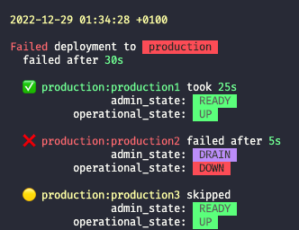
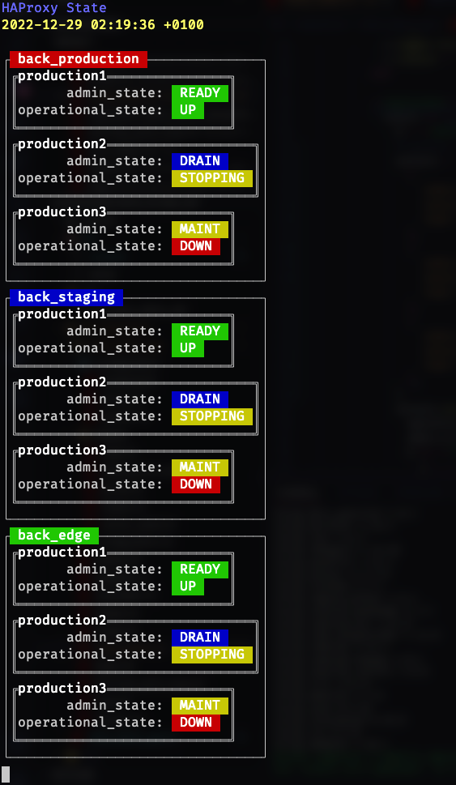

# Capistrano::DataPlaneApi

[Capistrano](https://capistranorb.com/) plugin which helps you
automatically change the admin state of your [HAProxy](https://www.haproxy.com/)
servers using the [Data Plane API](https://www.haproxy.com/documentation/dataplaneapi/community/).

[Capistrano](https://capistranorb.com/) is a remote server automation and deployment tool.
[HAProxy](https://www.haproxy.com/) is a load balancer.

## Installation

### Gemfile

Install the gem and add to the application's Gemfile by executing:

```sh
$ bundle add capistrano-data_plane_api
```

Or add it to `Gemfile` manually:

```rb
gem "capistrano-data_plane_api"
```

### Installer

Afterwards, you can use the installer to set up your app.

We highly recommend it.

```sh
$ bundle exec cap_data_plane_api install
```

## Usage

This gem hooks into capistrano to add new tasks which
enable you to change the admin state of your HAProxy
servers during the deployment process
using using the [Data Plane API](https://www.haproxy.com/documentation/dataplaneapi/community/).

We recommend creating separate Capistrano stages
for every HAProxy server.

## Deployment script

The installer generates a handy deployment script which
let's you deploy your app to all servers in a particular HAProxy
backend with one command.

All admin state switching is handled automatically for you.
You can go make yourself a coffee without having to worry.

It prints a beautiful summary after the deployment.




It can be invoked like that

```sh
$ bin/deploy -h
```

That particular command prints a help message, which is a good
reference for how to use this script.

```
Usage: bin/deploy [options]

This script can be used to deploy this app to remote servers.

    -c, --current                    Deploy from the currently checked out branch
    -t, --test                       Show the commands that would be executed but do not carry out the deployment
    -g, --group=GROUP                Deploy the code to every server in the passed HAProxy backend/group
        --no-haproxy                 Do not modify the state of any server in HAProxy
        --force-haproxy              Ignore the current state of servers in HAProxy
    -o, --only=ONLY                  Deploy the code only to the passed servers in the same order
    -H, --haproxy-config             Show the current HAProxy configuration
    -S, --haproxy-state              Show the current HAProxy state
    -T, --tasks                      Print a list of all available deployment Rake tasks
    -r, --rake=RAKE                  Carry out a particular Rake task on the server
    -h, --help                       Prints this help
    -b, --branch=BRANCH              Deploy the code from the passed Git branch
        --no-migrations              Do not carry out migrations
```

### Example of commands

#### Show the state of all HAProxy servers and live reload every 2 seconds

```sh
$ bin/deploy -S
```



#### Show the current config of this gem

```sh
$ bin/deploy -H
```

#### Deploy to all servers in the `staging` backend

```sh
$ bin/deploy -g staging
```

#### Deploy to all servers in the `staging` backend using the currently checked out git branch

```sh
$ bin/deploy -g staging -c
```

#### Deploy to `staging_serv3` and `staging_serv1` in the `staging` backend (in this order)

```sh
$ bin/deploy -g staging -o staging_serv3,staging_serv1
```

#### Deploy to all servers in the `edge` backend using the `development` git branch

```sh
$ bin/deploy -g edge -b development
```

#### Deploy to the `staging_serv3` server

Same as `cap staging_serv3 deploy`

```sh
$ bin/deploy staging_serv3
```

#### Carry out the `deploy:restart` Rake task on all servers in the `production` backend

```sh
$ bin/deploy -g production -r deploy:restart
```

## New Rake tasks

There are three new Rake tasks:

- `data_plane_api:server:set_drain` -- sets the admin state of the currently deployed server to `DRAIN`
- `data_plane_api:server:set_maint` -- sets the admin state of the currently deployed server to `MAINT`
- `data_plane_api:server:set_ready` -- sets the admin state of the currently deployed server to `READY`

To load them and and invoke them manually you should
add this line to your `Capfile`

```rb
require 'capistrano/data_plane_api'
```

These tasks will only run when the `:web` role is added to the deployment stage.

## Hooks

If you used the installer, your app is already
set up with hooks.

In order to use our recommended configuration of these
new tasks, you should add the following line to your
`Capfile`

```rb
require 'capistrano/data_plane_api/hooks'
```

Our config works as follows:

```
deploy
  deploy:starting
  deploy:started
    [after]
        data_plane_api:server:set_drain
  deploy:updating
  deploy:updated
  deploy:publishing
    [before]
        data_plane_api:server:set_maint
  deploy:published
  deploy:finishing
  deploy:finished
    [after]
        data_plane_api:server:set_ready
```

These tasks will only run when the `:web` role is added to the deployment stage.

## Development

After checking out the repo, run `bin/setup` to install dependencies. Then, run `rake test` to run the tests. You can also run `bin/console` for an interactive prompt that will allow you to experiment.

To install this gem onto your local machine, run `bundle exec rake install`. To release a new version, update the version number in `version.rb`, and then run `bundle exec rake release`, which will create a git tag for the version, push git commits and the created tag, and push the `.gem` file to [rubygems.org](https://rubygems.org).

## Contributing

Bug reports and pull requests are welcome on GitHub at https://github.com/espago/capistrano-data_plane_api.

## License

The gem is available as open source under the terms of the [MIT License](https://opensource.org/licenses/MIT).
